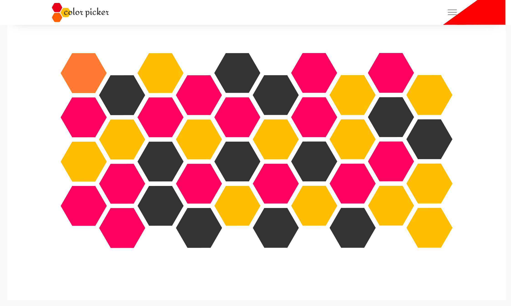
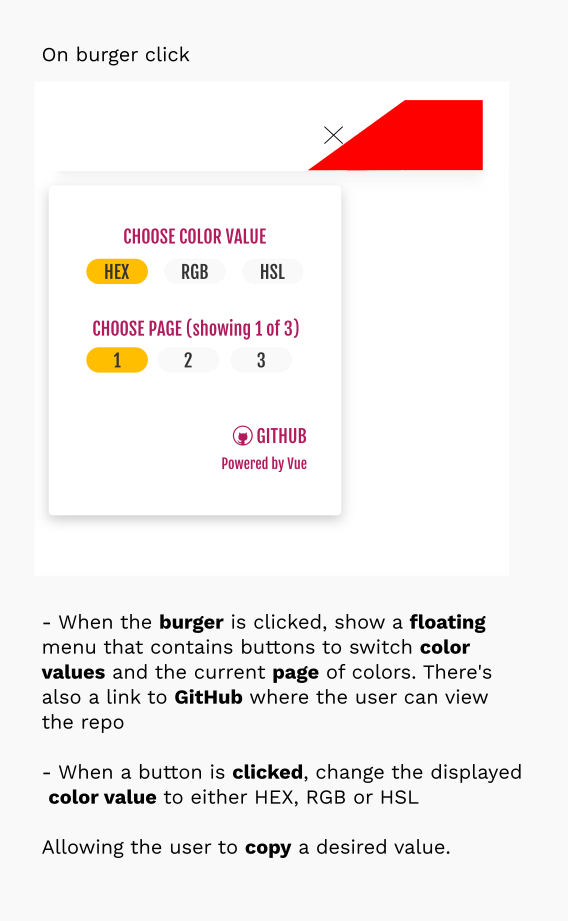
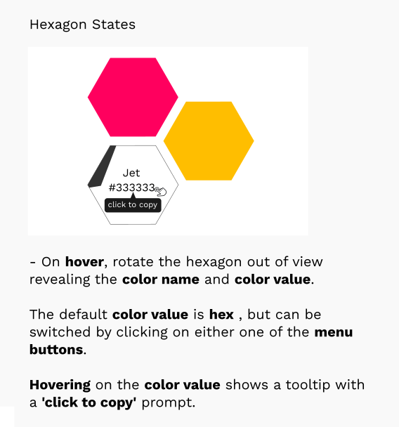
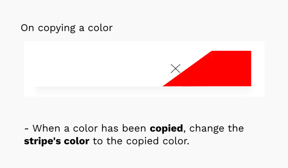
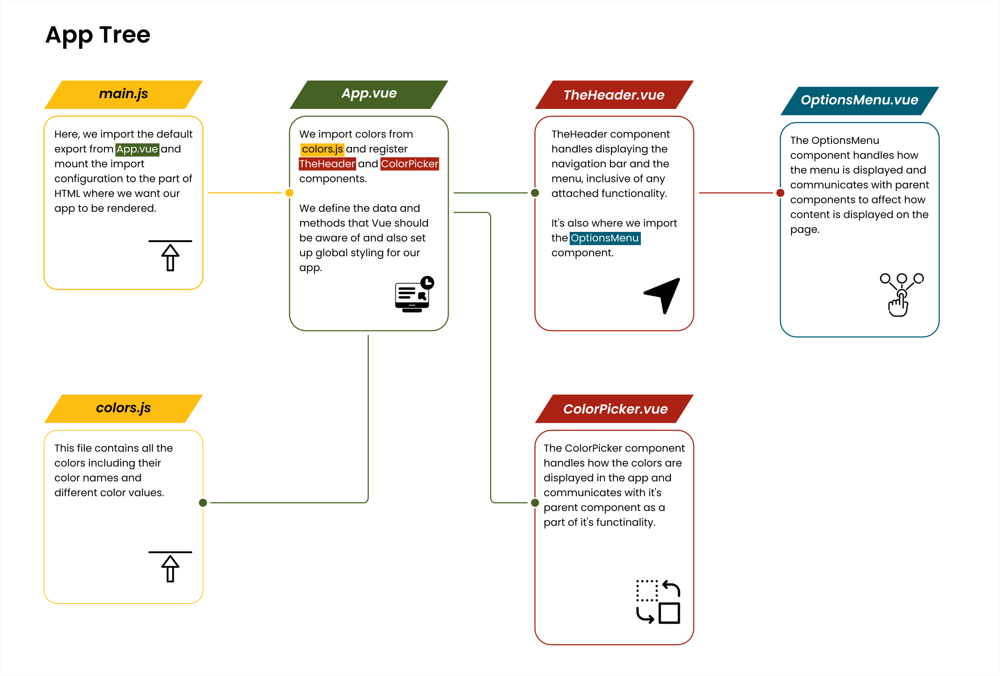

# Color Picker

This is a challenge I designed to help me practice my skills with the **[Vue.js](https://v3.vuejs.org)** framework.

## Table of contents

- [Overview](#overview)
  - [About the challenge](#about-the-challenge)
  - [Screenshots](#screenshots)
  - [Links](#links)
- [My process](#my-process)
  - [Built with](#built-with)
  - [What I learned](#what-i-learned)
  - [Continued development](#continued-development)
  - [Useful resources](#useful-resources)
- [Author](#author)

## Overview

---

---

### About the challenge

The challenge aims to test the developer's skill in:

- Creating and registering components
- Handling component communication

### Screenshots



Screenshot of the **Home** page design.

What's in view:

- It's shows the design of the site on **Desktop**.

---



Screenshot of the **Menu**.

What's in view:

- It's shows the design of the menu on **Desktop** and describes the attached functionality.

---



Screenshot of the **Hexagons**.

What's in view:

- It's shows the design of the hexagons on **Desktop** and describes the attached functionality.

---



Screenshot of the **Stripe**.

What's in view:

- It's shows the design of the stripe on **Desktop** and describes the attached functionality.

---



Screenshot of the **App tree**.

What's in view:

- It's shows an overview of the components, how they communicate with each other and also describes the attached functionality.

### Links

- Live Site URL: []()

## My process

---

---

It all started with the design. I knew that I wanted to build the site with hexagons, but I didn't know how. So with a bit of _googling_, I stumbled upon **_[CSS Tricks' guide to building hexagons](https://css-tricks.com/hexagons-and-beyond-flexible-responsive-grid-patterns-sans-media-queries)_**. After going through that and having a working prototype of the layout, I went on to implement displaying the _color names_ and _color values_ on the hexagons.

The initial plan was to have the _color names_ and _color values_ on top of the actual _colors_, but it quickly became apparent that I was going to have quite the challenge in making the text and colored backgrounds meet _accessibility standards_. So that's when the idea of having a separate layer to display the color details hit me - One standard background that completely solved that problem.

All that was left at this point was creating my **Vue** app and adding all the functionality to the app.

### Built with

- HTML5
- CSS Flexbox
- [Vue](https://v3.vuejs.org) - The Progressive JavaScript Framework
- [Inkscape](https://inkscape.org) - Inkscape: Open Source Scalable Vector Graphics Editor

### What I learned

The time I spent working on the project was a great way for me to practice my **Vue** skills - A great way for me to work with **Vue's** _reactivity_ and to get better at:

- **component communication**
  - This involves sending data from a _parent component_ to a _child component_ using a special **Vue** feature known as **[props](https://v3.vuejs.org/guide/component-props.html#prop-types)**.
  - The communication also works in the other direction i.e from a _child component_ to a _parent component_ using the built in **[custom events](https://v3.vuejs.org/guide/component-custom-events.html#event-names)** feature.
  - And if you want a sort of _long range_ communication between an _ancestor_ and a _descendant_, you have **[provide and inject](https://v3.vuejs.org/guide/component-provide-inject.html#working-with-reactivity)**. Another **Vue** provided feature.

**Here's some of the code that I'm proud of**:

- Using the `teleport` _component_ to, more or less, teleport the overlay to the `body` element, so that it can be rendered there instead of being deeply nested within the code structure to improve _accessibility_.

- Inside the `teleport` _component_, I have a `div` element where I'm binding the `class` _attribute_ to the `isActive` _data property_ and using a _ternary operator_ to add the `active` class to the `div` if the `isActive` property holds the value **`true`**.

- I'm also listening to a click event on the `div` element by using the `@click` listener and pointing to the `removeOverlay` method.

```html
<!-- Render the overlay in the body tag -->
<teleport to="body">
  <div
    class="overlay"
    :class="isActive ? 'active' : ''"
    @click="removeOverlay"
  ></div>
</teleport>
```

- Using **[Vue's lifecycle methods](https://v3.vuejs.org/guide/composition-api-lifecycle-hooks.html)** i.e the `mounted()` _lifecycle method_ to call the `displayColors()` method before the page has loaded.

```javascript
// use the mounted() lifecycle hook to execute the displayColors()
// method as soon as the page has loaded
mounted() {
  this.displayColors();
},
```

- To ensure that the _colors_ being displayed are the same despite whatever _color value_ is chosen i.e **HEX**, **RGB** or **HSL**, the chosen value is what is set as the background color for the hexagons.

- This is made possible by binding the `style` _attribute_ and setting the `background-color` _property_ to the value held in the `colorValue` **[prop](https://v3.vuejs.org/guide/component-props.html#prop-types)**

```html
<template>
  <div>
    <!-- code here -->
    <div class="color" :style="{ backgroundColor: colorValue }"></div>
    <!-- code here -->
  </div>
</template>
```

### Continued development

Going forward, I want continue learning more about **Frontend development** and to practice what I already know by tackling more projects built with **Vue**. Applying the features and best practices that I've learnt from working on this project.

### Useful resources

- [CSS Tricks](https://css-tricks.com) - _[CSS Tricks' guide to building hexagons](https://css-tricks.com/hexagons-and-beyond-flexible-responsive-grid-patterns-sans-media-queries)_ was very useful. It saved me a lot of precious time. Time that I would have otherwise spent on a lot of trial and error.

- [Inkscape](https://inkscape.org) - Inkscape SVG Editor. I use it all the time when I'm working on any web project. After designing the project, I used **Inkscape's** in-built tools to help me figure out the **spacing**, **sizing** and **positioning** of elements throughout the project. To better understand how I approached coding the project using Inkscape, have a look at this repository I made - [Designing and Coding Layouts](https://github.com/AllanKirui/designing-and-coding-layouts)

- [Vue Presentation](https://allankirui.github.io/A-Vuejs-Presentation/) - A while back after I had started learning **Vue**, I made a presentation on the framework. Do take a look, it might give you a better understanding of what the framework is about.

## Author

---

---

- Github - [Allan Kirui](https://www.github.com/AllanKirui)
- Instagram - [@nallawilljr](https://www.instagram.com/nallawilljr)

[Back to top](#color-picker)
